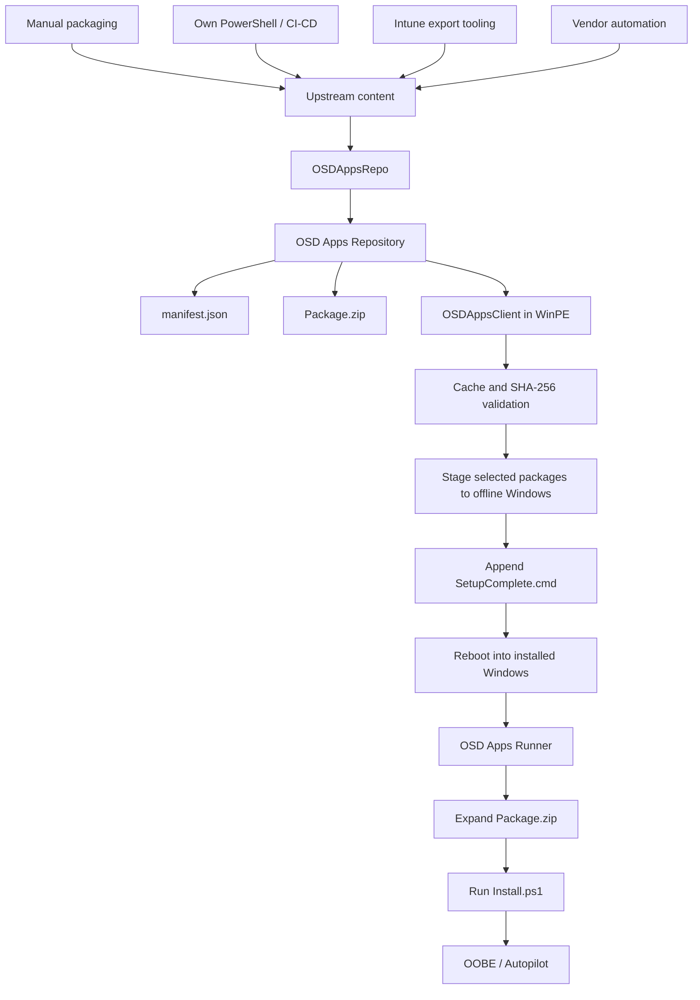

# OSD Apps Architecture

OSD Apps is split into two PowerShell modules with a shared repository contract.



## Module boundary

### OSDAppsRepo

Recommended authoring and repository-management layer.

It creates and validates `Package.zip`, calculates hashes, publishes packages, and maintains `manifest.json`.

Upstream integrations are not part of OSDAppsRepo. Separate tooling may obtain content from Intune, vendor feeds, package feeds, GitHub Releases, or any other source and hand a source directory or compliant package to OSDAppsRepo.

### OSDAppsClient

WinPE consumer/runtime module designed specifically to complement OSDCloud v2.

It runs after OSDCloud v2 has applied Windows and drivers. It does not authenticate to Intune or build packages. It consumes a prepared repository, caches and validates packages, stages selected content to the offline Windows volume, and prepares SetupComplete.

## Shared package contract

Each application is represented by exactly one archive named `Package.zip`.

`Package.zip` must contain `Install.ps1` at the root.

Repository layout:

```text
Repository/
├── manifest.json
└── Packages/
    └── <AppId>/
        └── <Version>/
            └── Package.zip
```

The package stays compressed in the repository, cache, and staging location. It is extracted only when the OSD Apps Runner installs the application under the installed Windows environment before OOBE.
