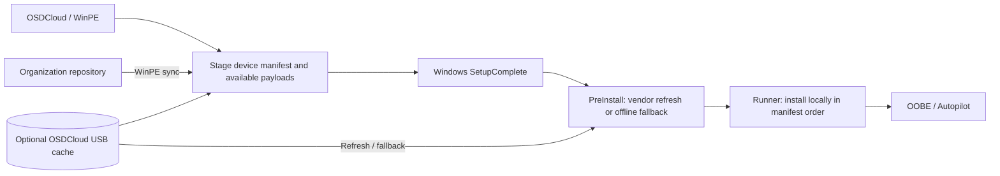

# OSDApps

[](https://www.powershellgallery.com/packages/OSDApps)
[%3D'VersionDownloadCount'%5D&label=downloads%20(latest)&color=blue&cacheSeconds=3600)](https://www.powershellgallery.com/packages/OSDApps)
[](https://github.com/roryvossepoel/OSDApps/actions/workflows/ci.yml)
[](#install-from-powershell-gallery)
[](LICENSE)

OSDApps is a PowerShell module for application deployment with OSDCloud v2, combining self-maintained repository packages, vendor-native built-ins, optional USB caching, and pre-OOBE installation through SetupComplete.

It adds a simple application layer to Windows deployment:

- synchronize organization-managed repository applications in WinPE;
- acquire vendor-maintained built-in applications during first boot;
- optionally reuse and refresh an `OSDCloud` USB cache;
- stage everything locally before installation;
- install applications through SetupComplete before OOBE / Autopilot continues.


## Install from PowerShell Gallery

For **WinPE and Windows PowerShell 5.1**, use PowerShellGet:

```powershell
Install-Module OSDApps -SkipPublisherCheck
Import-Module OSDApps
```

To install a specific, reproducible release (for example, the x64 Webex field-tested 0.32.0):

```powershell
Install-Module OSDApps -RequiredVersion 0.32.0 -Force -SkipPublisherCheck
Import-Module OSDApps -RequiredVersion 0.32.0 -Force
```

`Install-PSResource` is the newer PSResourceGet equivalent, but PSResourceGet is not normally available by default in Windows PowerShell 5.1 / WinPE. For OSDCloud and WinPE scenarios, `Install-Module` is therefore the recommended installation method.

On systems where Microsoft.PowerShell.PSResourceGet is available, the equivalent command is:

```powershell
Install-PSResource OSDApps
```

## Deployment model

OSDApps supports two application sources.

| Source | Ownership | Acquisition / refresh | Installation |
| --- | --- | --- | --- |
| **Repository** | Organization | WinPE sync/cache + staging | SetupComplete |
| **Built-in** | Vendor / OSDApps integration | Full Windows PreInstall | SetupComplete |

Both sources are written into one ordered `Apps[]` queue in `DeviceManifest.json`.

The order in which applications are added is the order in which they are installed.

The example below deliberately mixes both source types. Microsoft 365 Apps, Teams, Chrome, and Adobe are **built-in applications**. `OmnissaHorizonClient` and `NotepadPlusPlus` are **example repository applications** that come from the organization's configured OSDApps repository; they are not built into OSDApps.

```powershell
# Built-ins
Add-OSDAppMicrosoft365Apps
Add-OSDAppMicrosoftTeams
Add-OSDAppGoogleChromeEnterprise
Add-OSDAppAdobeAcrobatUnified
Add-OSDAppCiscoWebex

# Self-maintained repository examples
Add-OSDApp OmnissaHorizonClient
Add-OSDApp NotepadPlusPlus
```

When a configured repository is temporarily unreachable, `Add-OSDApp` can continue with the local cache **only if every requested package is present and passes SHA-256 validation**. To deliberately skip the online refresh (for example, when deploying offline from a prepared USB cache):

```powershell
Add-OSDApp NotepadPlusPlus -SkipCacheRefresh
```

`-WhatIf` previews staging without synchronizing, downloading, or modifying the offline Windows installation. `-SkipCacheRefresh` applies to repository applications; built-in applications have their own acquisition logic.

produces:

```text
Microsoft 365 Apps
→ Microsoft Teams
→ Google Chrome Enterprise
→ Adobe Acrobat Unified
→ Cisco Webex
→ Omnissa Horizon Client
→ Notepad++
```

## Quick start

Typical WinPE flow after OSDCloud has applied Windows:

```powershell
Import-Module OSDApps

Set-OSDAppConfiguration `
    -CatalogUri 'https://example.blob.core.windows.net/osdapps/catalog.json' `
    -CleanupMode OnSuccess

Get-OSDAppConfiguration
Get-OSDAppCatalog
Get-OSDApp

# Built-ins
Add-OSDAppMicrosoft365Apps
Add-OSDAppMicrosoftTeams
Add-OSDAppGoogleChromeEnterprise
Add-OSDAppAdobeAcrobatUnified
Add-OSDAppCiscoWebex

# Examples resolved from your configured repository
Add-OSDApp OmnissaHorizonClient
Add-OSDApp NotepadPlusPlus
```

No OSDApps module installation is required in the deployed Windows installation. The required standalone runtime is staged automatically.

**Version 0.31.0 breaking rename:** the built-in app is now `MicrosoftTeams`, including `Add-OSDAppMicrosoftTeams`, `Sync-OSDAppMicrosoftTeams`, and USB staging under `BuiltIn\MicrosoftTeams`. No aliases or automatic migration from `BuiltIn\Teams` are provided. Re-synchronize the new Teams cache before any offline deployment using existing media.

Default runtime log:

```text
%ProgramData%\OSDApps\Logs\Runtime.log
```

Module/cache log:

```text
<OSDCloud>:\OSDApps\Logs\Client.log
```

## Built-in applications

Current built-ins:

| Application | Vendor-native source |
| --- | --- |
| Microsoft 365 Apps | Office Deployment Tool |
| Microsoft Teams | Teams bootstrapper + official MSIX |
| Adobe Acrobat Unified | Adobe Unified installer |
| Google Chrome Enterprise | Google Enterprise MSI |
| Mozilla Firefox Enterprise | Mozilla MSI |
| Cisco Webex | Cisco non-localized Webex App MSI (x64/ARM64) |

Built-ins are always acquired directly from the software vendor. OSDApps does not redistribute built-in application binaries.

A built-in is optional: any application can still be delivered through the self-maintained repository when organization-controlled packaging or versioning is preferred.

For Microsoft 365 Apps, for example:

```text
Built-in
→ ODT checks and refreshes Office in full Windows
→ Microsoft remains the freshness source

Repository
→ organization controls the Office package/version
→ repository sync happens in WinPE
→ full Windows only installs the staged package
```

### Cisco Webex (new in 0.32.0)

Cisco Webex App is available as a vendor-native built-in, with x64 or ARM64 MSI and optional USB caching. No separate Meetings bundle or VDI support is included.

```powershell
Add-OSDAppCiscoWebex
# Optional: enable Control Hub-aligned post-login updates, and prefill the UPN at Webex sign-in
Add-OSDAppCiscoWebex -PreventPreLoginUpdates $true -EmailHint '$userPrincipalName'
```

The default install is per-machine and does not auto-start with Windows. See [Cisco Webex options](docs/built-in-apps.md#cisco-webex) for MSI properties and offline-cache preparation.

See [Built-in applications](docs/built-in-apps.md).

Machine-readable built-in metadata is published in [`metadata/builtins.json`](metadata/builtins.json), including **CiscoWebex**, its public icon URL, architecture options and Add/Sync commands. This public JSON can power repository viewers and dashboards without scraping PowerShell code. It describes **built-ins**, not the contents of an organization's private `catalog.json` repository. See [Public metadata contract](docs/public-metadata.md).

## Deployment in one diagram



Repository packages synchronize in **WinPE**. Vendor-native built-ins refresh in **full Windows**; a complete staged MSI can be used offline. Installation **always runs from local staging**, never directly from USB.

## Repository applications

An OSDApps repository is static content owned and maintained by the organization. No repository service or separate module is required.

Names such as `OmnissaHorizonClient` and `NotepadPlusPlus` used elsewhere in this documentation are examples of applications published in such a self-maintained repository. OSDApps itself does not ship or maintain those packages.

For repository applications, synchronization and cache population happen in **WinPE**. When `Add-OSDApp` is called, OSDApps resolves the requested package from the configured repository, updates/reuses the optional OSDCloud USB cache, validates the package hash, and stages the package to the offline Windows installation. SetupComplete later installs that already-staged local content; it does not re-synchronize repository applications.

```text
Repository/
├── catalog.json
└── Apps/
    └── <AppId>/
        └── <Version>/
            └── <Architecture>/
                ├── manifest.json
                └── Package.zip
```

A package contains:

```text
Package.zip
└── Package/
    ├── Install.ps1
    └── payload
```

OSDApps includes optional authoring and validation helpers:

```powershell
New-OSDAppRepository
New-OSDAppPackage
Add-OSDAppPackage
Test-OSDAppPackage
Test-OSDAppRepository
```

See [Repository applications](docs/repository.md).

## Optional OSDCloud cache

A volume labeled `OSDCloud` is detected automatically.

```text
USB cache + online
→ reuse current content
→ refresh only where required
→ stage locally
→ install

USB cache + offline
→ use complete cached content
→ install

No USB + online
→ acquire built-ins directly to the local runtime
→ install
```

Repository applications synchronize/cache in **WinPE** and are staged to the offline OS before reboot. Built-in freshness checks happen later in full Windows during PreInstall before installation.

Inspect the current cache with:

```powershell
Get-OSDAppCache
```

## Validated deployment scenarios and performance

Four fresh OSDCloud v2 deployments with **OSDApps 0.30.0** were completed on 9 October 2026 using the same six-app queue (four built-ins and two example repository packages).

| Scenario | PreInstall | Runner | Measured Windows phase | Install results |
| --- | ---: | ---: | ---: | --- |
| No USB cache | 217.3 s | 329.3 s | **9:07** | 6/6 |
| Cold USB cache | 114.2 s | 328.4 s | **7:23** | 6/6 |
| Warm USB cache | 41.7 s | 330.4 s | **6:12** | 6/6 |
| Warm USB, changed Office XML | 104.1 s | 346.0 s | **7:30** | 6/6 |

All four runs completed PreInstall and Runner successfully: **24/24 application queue executions reported success**. The changed-Office scenario included Dutch Microsoft 365 Apps, Visio and Project; Word, Excel, Visio and Project executables were also confirmed present after installation.

These times cover **PreInstall + Runner only**. They do not include WinPE staging or Windows image deployment. A warm USB cache saved **70.5 seconds** compared with the cold USB run, principally in PreInstall. One run per scenario is not a statistical benchmark. Effective Office update channel and licensing activation remain unchecked.

**Later deployments:** OSDApps 0.31.0 completed a six-app queue (6/6) with working Adobe staging, MicrosoftTeams cache rename and `CleanupMode OnSuccess`. OSDApps 0.32.0 passed Cisco Webex **x64** direct MSI installation, online SetupComplete, cold/warm cache, and fully offline SetupComplete (single-app queue). The ARM64 option is implemented but **not field-validated**; a combined seven-app deployment remains untested.

Read the [0.30.0 validation matrix](docs/testing.md) and [detailed performance measurements](docs/performance.md) for setup, evidence, caveats and remaining test coverage.

### Earlier 0.29.1 benchmark

The historical cold/warm benchmark using the same hardware and USB stick reported **455.9 s** (cold) and **368.0 s** (warm).


The graphic and original details remain available in [Performance](docs/performance.md); do not combine the 0.29.1 historical measurements with the 0.30.0 field test as if they were the same controlled benchmark.

## Development

Automated validation includes:

```text
PSScriptAnalyzer
→ Pester
→ example validation
→ distributable module build
```

Run the same validation locally with:

```powershell
./build/Test-Module.ps1
```

Every push to `main` and every pull request runs GitHub Actions CI.

PowerShell Gallery publishing uses a separate release workflow and is not performed by normal CI.

See [Releasing](docs/releasing.md).

## Documentation

- [Architecture](docs/architecture.md)
- [Built-in applications](docs/built-in-apps.md)
- [Public JSON metadata for repository viewers](docs/public-metadata.md)
- [Repository applications](docs/repository.md)
- [Runtime and cleanup](docs/runtime.md)
- [Performance](docs/performance.md)
- [Validation matrix](docs/testing.md)
- [FAQ and troubleshooting](docs/faq.md)
- [Releasing](docs/releasing.md)
- [Changelog](CHANGELOG.md)

## License

OSDApps is licensed under the [MIT License](LICENSE).
