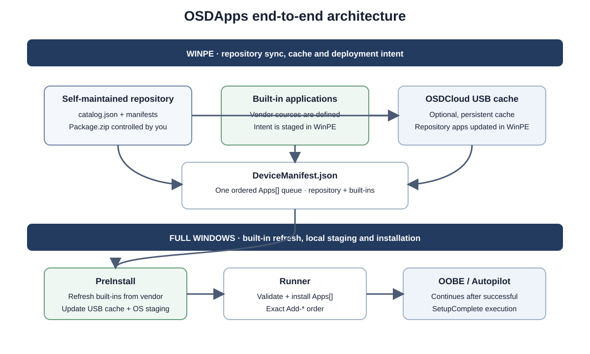
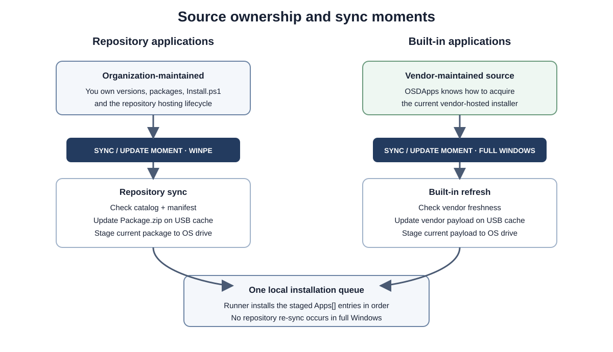
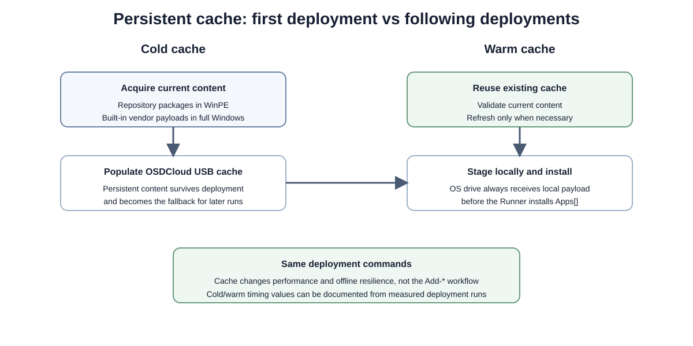
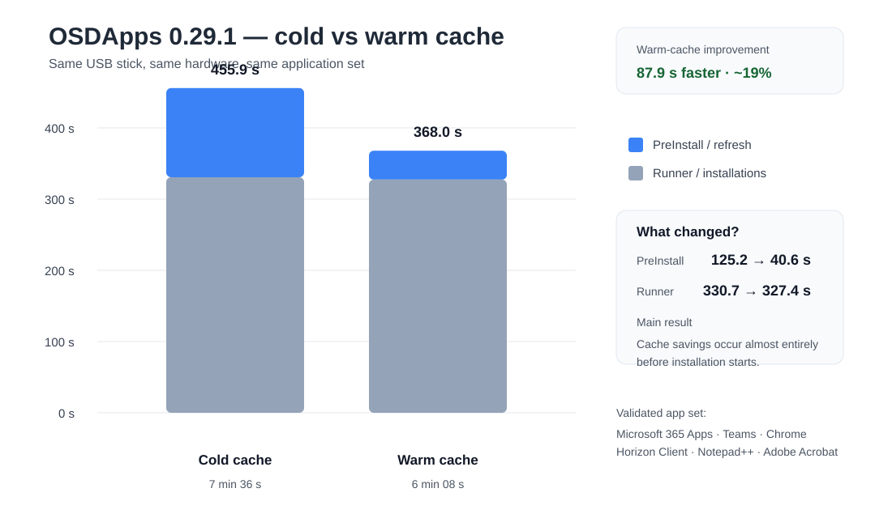
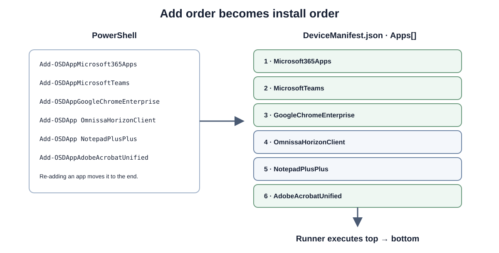

# OSDApps

OSDApps is a PowerShell module and standalone runtime for OSDCloud v2 application caching, staging, refresh, and pre-OOBE installation.

It is designed around a simple deployment model:




```text
WinPE
→ OSDCloud applies Windows and drivers
→ repository applications are synchronized/cached in WinPE
→ Add-* stages application intent and available content to the offline OS

First boot / full Windows
→ built-in application sources are resolved automatically
→ optional OSDCloud USB cache is used and updated when present
→ otherwise content is acquired directly to the local Windows runtime
→ SetupComplete installs applications
→ temporary source is removed
→ OOBE / Autopilot continues
```

## Key concepts




OSD Apps supports two application sources:

| Source | Acquisition / sync | Installation |
| --- | --- | --- |
| Repository apps | WinPE | SetupComplete |
| Built-in applications | Full Windows pre-install phase | SetupComplete |

Repository apps use the OSD Apps package contract: `Package.zip` with a top-level `Package` folder containing `Install.ps1` and the installation payload.

Built-in apps use vendor-native acquisition and installation:
- Microsoft 365 Apps uses the Office Deployment Tool.
- Microsoft Teams uses the Teams bootstrapper and official MSIX.
- Adobe Acrobat Unified uses Adobe's official Unified installer ZIP, which is cached compressed, extracted locally, and installed through Setup.exe.
- Google Chrome Enterprise uses Google's official Enterprise MSI.
- Mozilla Firefox Enterprise uses Mozilla's official MSI for Rapid Release or ESR.

## Quick start

Typical WinPE flow after OSDCloud v2 has finished:

```powershell
Import-Module OSDApps

# General configuration
Set-OSDAppConfiguration `
    -CatalogUri 'https://example.blob.core.windows.net/osdapps/catalog.json' `
    -CleanupMode OnSuccess `
    -CacheVolumeLabel 'OSDCloud' `
    -LogPath '%ProgramData%\OSDApps\Logs\Runtime.log'

Get-OSDAppConfiguration
Get-OSDAppCatalog

# Discover repository and built-in applications
Get-OSDApp

# Add-OSDApp automatically synchronizes the requested repository package
Add-OSDApp NotepadPlusPlus
Add-OSDAppMicrosoft365Apps
Add-OSDAppTeams
Add-OSDAppAdobeAcrobatUnified
Add-OSDAppGoogleChromeEnterprise
Add-OSDAppMozillaFirefoxEnterprise
```

For built-ins only, no catalog or repository synchronization is required:

```powershell
Add-OSDAppMicrosoft365Apps
Add-OSDAppTeams
Add-OSDAppAdobeAcrobatUnified
```

For built-in cache configuration and synchronization on full Windows:

```powershell
Sync-OSDAppMicrosoft365Apps `
    -Channel Current `
    -Architecture 64 `
    -ProductId O365ProPlusRetail `
    -Language nl-nl,en-us

Sync-OSDAppTeams -Architecture x64
Sync-OSDAppGoogleChromeEnterprise
Sync-OSDAppMozillaFirefoxEnterprise
```

## General configuration

OSDApps uses one session-scoped configuration object:

```powershell
Set-OSDAppConfiguration `
    -CatalogUri 'https://example.blob.core.windows.net/osdapps/catalog.json' `
    -CleanupMode OnSuccess `
    -CacheVolumeLabel 'OSDCloud' `
    -LogPath '%ProgramData%\OSDApps\Logs\Runtime.log'
```

Current values can be inspected with:

```powershell
Get-OSDAppConfiguration
```

Settings can also be changed individually. Unspecified values are preserved.

`CleanupMode` supports:

```text
OnSuccess  remove the staged runtime after a successful run
Never      retain the staged runtime and work files
```

The effective runtime settings are written to `DeviceManifest.json` when applications are staged.

## Optional OSDCloud USB cache




USB media is optional for built-in applications.

If a USB volume with the label `OSDCloud` is connected, OSD Apps detects it automatically and uses it as the cache source and destination. No `OSDApps` folder or pre-existing cache is required: a blank `OSDCloud` volume can be populated automatically during deployment.

```text
OSDCloud USB + online
→ use existing cache when available
→ refresh/update cache
→ stage current content locally
→ install

OSDCloud USB + offline
→ use complete cached content
→ install

No USB + online
→ acquire directly to %SystemRoot%\Temp\OSDApps
→ install
```

Repository applications synchronize/cache in WinPE. When an online catalog is configured, `Add-OSDApp` automatically refreshes only the requested repository application(s) before staging. `Sync-OSDAppRepository` remains available for explicit cache preloading or maintenance. Built-in applications synchronize/update during SetupComplete in full Windows.

> **When an OSDCloud USB cache is detected, keep it connected until OOBE is displayed.**

## Transparent source resolution

The same built-in Add commands are used regardless of how content will be acquired:

```powershell
Add-OSDAppMicrosoft365Apps
Add-OSDAppTeams
```

The runtime decides the source automatically. USB cache availability changes performance and offline capability, not the deployment command.

Use `-Verbose` to see Windows target resolution, OSDCloud cache detection, cache state, staging decisions, and the selected acquisition path.

Verbose output uses a compact OSDCloud-style deployment format with timestamps, severity labels and short component names, for example:

```text
[2026-10-05T09:10:12] [INFO] Cache: OSDCloud cache found at E:\OSDApps
[2026-10-05T09:10:12] [INFO] Microsoft365Apps: No existing cache found; cache will be created during SetupComplete
```

The same decisions are also written to the CMTrace-compatible logs.

## Validated deployment scenarios

The built-in cache bootstrap flow has been validated end to end with a completely blank `OSDCloud` USB cache:

```text
blank USB with label OSDCloud
→ Add-OSDAppMicrosoft365Apps
→ Add-OSDAppTeams
→ no usable built-in cache present in WinPE
→ SetupComplete detects the OSDCloud volume
→ Microsoft 365 Apps cache is created from scratch
→ Microsoft Teams cache is created from scratch
→ both payloads are staged locally
→ both applications install successfully
→ temporary runtime cleanup is scheduled
```

This confirms that pre-populating `<OSDCloud>:\OSDApps` is not required for built-in deployment.

An existing-cache + online refresh run has also been validated: both built-in caches were detected in WinPE, Office synchronized without a version change, Teams reported no package update, and both applications installed successfully from the local staged runtime.

## Validated performance benchmark

OSDApps 0.29.1 has been validated with the same hardware, USB cache and application queue in both cold-cache and warm-cache runs.



| Phase | Cold cache | Warm cache | Difference |
| --- | ---: | ---: | ---: |
| PreInstall / refresh | 125.2 s | 40.6 s | -84.6 s |
| Runner / installations | 330.7 s | 327.4 s | -3.3 s |
| **Total measured Windows phase** | **455.9 s** | **368.0 s** | **-87.9 s** |

The warm cache reduced the measured Windows phase by about **1 minute 28 seconds**. Almost all of the gain came from PreInstall / refresh; Runner installation time remained effectively unchanged.

This is the expected cache behavior: reduce acquisition and freshness work while keeping the application installation queue stable.

See [Performance](docs/performance.md) for the full benchmark, per-application timings, download observations and reproduction steps.

## Runtime locations

Temporary deployment source:

```text
%SystemRoot%\Temp\OSDApps
```

Persistent logs:

```text
%ProgramData%\OSDApps\Logs\Runtime.log
```

With `CleanupMode OnSuccess`, the temporary runtime/source directory is removed after a successful run. With `CleanupMode Never`, the staged runtime and work files are retained. Logs are written to the configured `LogPath`.

On failure, the local runtime source is retained for troubleshooting.

## Built-in applications

Currently supported:

```text
Microsoft365Apps
Teams
AdobeAcrobatUnified
GoogleChromeEnterprise
MozillaFirefoxEnterprise
```

Each built-in has its own configuration/synchronization cmdlet and its own Add cmdlet:

```powershell
Sync-OSDAppMicrosoft365Apps
Sync-OSDAppTeams
Sync-OSDAppAdobeAcrobatUnified
Sync-OSDAppGoogleChromeEnterprise
Sync-OSDAppMozillaFirefoxEnterprise

Add-OSDAppMicrosoft365Apps
Add-OSDAppTeams
Add-OSDAppAdobeAcrobatUnified
```

There is intentionally no generic `Sync-OSDAppBuiltIn` command. Each built-in owns its own parameter set and configuration.

See [Built-in applications](docs/built-in-apps.md).

## Built-in source policy

OSDApps never ships built-in application binaries, installers, archives, or repackaged vendor content.

For every built-in application, deployment content is always acquired directly from the software vendor at deployment/cache time. The module contains only the logic and vendor source definitions required to locate, cache, stage, and install that content.

```text
Built-in application
→ source is always the vendor
→ OSDApps may cache/stage the vendor content
→ OSDApps never redistributes the installer itself
```

This policy applies only to built-in applications. Repository applications are organization-controlled packages; their content, hosting, licensing, and provenance are the repository owner's responsibility.

## Requesting a built-in application

Built-in applications are intentionally limited to broadly used products with a clean, vendor-supported acquisition path. Requests are welcome, but a built-in should meet all of these requirements:

- the application is broadly used across organizations, not a customer-specific or niche line-of-business app;
- the installer can be downloaded directly and reproducibly from the software vendor;
- the built-in content will always be acquired from the vendor at runtime/cache time; no installer may be bundled with or redistributed through OSDApps;
- the vendor provides a stable URL, documented endpoint, or another deterministic download mechanism;
- acquisition does not require scraping a website, sniffing browser traffic, extracting temporary URLs, session cookies, access tokens, or other brittle workarounds;
- a CDN is fine when the vendor exposes a stable supported download URL, but not when CDN protection requires bypassing or reverse-engineering the download flow;
- the installer supports a reliable unattended enterprise installation;
- the acquisition and install flow can be maintained without depending on undocumented tricks.

If an application does not meet these criteria, package it as a normal repository application instead. The repository model is the intended path for niche, customer-specific, internally hosted, authenticated, or otherwise non-generic applications.

See [Built-in applications](docs/built-in-apps.md#requesting-a-new-built-in-application) for the full policy.

## Built-in or self-maintained repository

Built-ins are convenience integrations, not mandatory deployment paths.

A supported application can still be delivered as a normal repository package when an organization prefers to control the package and version itself.

A good example is Microsoft 365 Apps:

```text
Built-in
→ ODT checks/synchronizes Office in full Windows
→ Microsoft remains the freshness source
→ cache can update automatically

Repository
→ organization controls the Office package/version
→ repository synchronizes in WinPE
→ full Windows only installs the staged package
```

This is one of the core OSDApps design choices: choose **vendor-native evergreen maintenance** or **organization-owned deterministic packaging** per application.

See [Built-in applications](docs/built-in-apps.md#choosing-built-in-office-or-repository-office) and [Repository applications](docs/repository.md#built-in-or-repository).

## Repository metadata model

Online repository metadata is deliberately simple:

```text
catalog.json
└── Apps/<AppId>/<Version>/<Architecture>/
    ├── manifest.json
    └── Package.zip
```

`catalog.json` is only the root index. Every deployable package is self-contained: its `manifest.json` sits directly beside `Package.zip` and contains the Id, display name, version, architecture, success codes, archive filename, and SHA-256.

Local deployment metadata remains separate:

```text
CacheCatalog.json    local OSDCloud USB snapshot of selected repository packages
DeviceManifest.json  per-device staged installation manifest
```

`Get-OSDAppCatalog` reports catalog status. `Get-OSDApp` resolves application manifests and combines online repository state, local cache state, and built-in applications.

## Repository authoring helpers

OSDApps includes optional helpers for creating and validating the static repository contract. They are convenience commands, not a repository service and not required at deployment time.

```powershell
New-OSDAppRepository -Path C:\OSDApps\Repository

New-OSDAppPackage `
    -Id ExampleApp `
    -Version 1.0.0 `
    -SourcePath C:\OSDApps\Packages\ExampleApp `
    -OutputPath C:\OSDApps\Build\ExampleApp

Add-OSDAppPackage `
    -Id ExampleApp `
    -DisplayName 'Example App' `
    -Version 1.0.0 `
    -Architecture x64 `
    -PackagePath C:\OSDApps\Build\ExampleApp\Package.zip `
    -RepositoryPath C:\OSDApps\Repository

Test-OSDAppRepository C:\OSDApps\Repository
```

The complete repository can also be created manually from the documented JSON contract and example structure.

## Repository applications

Repository packages remain compressed while cached and staged.

```text
Package.zip
└── Package/
    ├── Install.ps1
    ├── setup.exe / setup.msi / other payload
    ├── Config/
    └── Files/
```

The package author is responsible for making `Install.ps1` completely unattended and suitable for SetupComplete.

See [Repository applications](docs/repository.md).

## Installation order




Application installation order follows the order in which the `Add-*` commands are called, across both repository and built-in applications.

```powershell
Add-OSDAppTeams
Add-OSDAppMicrosoft365Apps
Add-OSDApp OmnissaHorizonClient
Add-OSDAppAdobeAcrobatUnified
```

produces:

```text
Teams
→ Microsoft 365 Apps
→ Omnissa Horizon Client
→ Adobe Acrobat Unified
```

`DeviceManifest.json` contains a single ordered `Apps` array. The runner installs those entries from top to bottom. Re-adding an application moves that full app entry to the end of `Apps` instead of creating a duplicate.

## Cache inventory

The effective OSDCloud cache can be inspected without changing it:

```powershell
Get-OSDAppCache
```

The command reports repository and built-in cache entries with fields such as:

```text
Id
Source
Version
Architecture
Channel
Language
SourcePolicy
SyncMethod
LastSynced
SizeMB
Valid
CachePath
```

This is intended for troubleshooting, validation, and reporting. Repository packages are validated against the SHA-256 stored in `CacheCatalog.json`; built-in entries are checked for the payload files required by their acquisition model.

## Runtime behavior

The standalone runtime does not require the OSDApps module to be installed in Windows.

The Add cmdlets stage everything needed for the first boot:
- `DeviceManifest.json`
- `Invoke-OSDAppPreInstall.ps1`
- `Invoke-OSDAppRunner.ps1`
- repository packages when applicable
- built-in deployment intent
- available built-in cache content when present

SetupComplete runs the standalone pre-install phase first and the installer second.

See [Runtime and cleanup](docs/runtime.md).

## Public commands

```text
Set-OSDAppConfiguration
Get-OSDAppConfiguration
Get-OSDAppCatalog
Get-OSDApp
Get-OSDAppCache

Sync-OSDAppRepository
Sync-OSDAppMicrosoft365Apps
Sync-OSDAppTeams
Sync-OSDAppAdobeAcrobatUnified
Sync-OSDAppGoogleChromeEnterprise
Sync-OSDAppMozillaFirefoxEnterprise

Add-OSDApp
Add-OSDAppMicrosoft365Apps
Add-OSDAppTeams
Add-OSDAppAdobeAcrobatUnified
Add-OSDAppGoogleChromeEnterprise
Add-OSDAppMozillaFirefoxEnterprise

Clear-OSDAppCache

New-OSDAppRepository
New-OSDAppPackage
Add-OSDAppPackage
Test-OSDAppPackage
Test-OSDAppRepository
```

Low-level cache validation, content staging, repository synchronization internals, and SetupComplete integration are private implementation details.

## Development and CI

OSDApps includes automated validation with Pester and PSScriptAnalyzer.

Run the same validation locally with:

```powershell
./build/Test-Module.ps1
```

Every push to `main` and every pull request runs the GitHub Actions CI workflow. Successful builds produce a distributable `OSDApps` workflow artifact.

PowerShell Gallery publishing is handled by a separate release workflow and is never performed by the normal CI workflow.

See [Releasing](docs/releasing.md) for the complete validation, build and PSGallery release flow.

## Documentation

- [Architecture](docs/architecture.md)
- [Built-in applications](docs/built-in-apps.md)
- [Repository applications](docs/repository.md)
- [Runtime and cleanup](docs/runtime.md)
- [Performance](docs/performance.md)
- [FAQ and troubleshooting](docs/faq.md)
- [Validation matrix](docs/testing.md)
- [Releasing](docs/releasing.md)
- [Changelog](CHANGELOG.md)

## Repository authoring

A repository is content, not a separate runtime component or module. OSDApps defines the repository contract, ships a working template under `Examples`, and includes lightweight authoring helpers:

```powershell
New-OSDAppRepository
New-OSDAppPackage
Add-OSDAppPackage
Test-OSDAppPackage
Test-OSDAppRepository
```

These helpers create the required folders and JSON, build the fixed `Package.zip` structure, calculate SHA-256, maintain `catalog.json`, and validate the repository before publication.

The repository itself remains static content and can be hosted on any HTTP/HTTPS endpoint that preserves the documented paths. No separate OSDAppRepo module is required.

See [Repository applications](docs/repository.md) and [Examples](Examples/README.md).


## License

OSDApps is licensed under the [MIT License](LICENSE).
