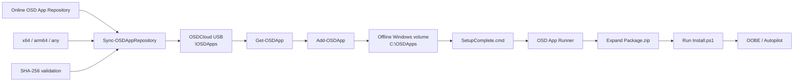

# OSD App Client

OSD App Client is a PowerShell module for Windows PE, designed specifically to complement OSDCloud v2.

It runs after OSDCloud v2 has applied Windows and drivers. The module consumes a prepared OSD Apps repository, synchronizes and validates application packages, stages selected packages to the offline Windows volume, and appends a SetupComplete hook so the applications are installed before OOBE.


## Architecture overview



Typical WinPE usage after OSDCloud v2 has finished applying Windows and drivers:

```powershell
Sync-OSDAppRepository 'https://example.org/osdapps/manifest.json'

Get-OSDApp

Get-OSDApp NotepadPlusPlus | Add-OSDApp
```

OSDAppClient consumes only the prepared repository and local USB cache. It does not authenticate to Intune or any other upstream source during WinPE runtime.

## Scope

OSD App Client does not build application packages and does not authenticate to Intune or Microsoft Graph.

It consumes repositories that follow the OSD Apps repository contract.

Supported repository locations:
- Local path
- UNC path
- HTTP/HTTPS

## Package contract

Every application is represented by a single archive named `Package.zip`.

`Package.zip` must contain `Install.ps1` at the archive root.

Example:

```text
Package.zip
├── Install.ps1
├── setup.exe
├── Config/
├── Modules/
└── Files/
```

The ZIP remains compressed while it is stored, cached, and staged. It is extracted only at installation time.

## Runtime flow

```text
OSDCloud v2 in WinPE
        ↓
Windows + drivers applied
        ↓
OSDAppClient
        ↓
Read repository manifest
        ↓
Sync / validate Package.zip
        ↓
Stage selected packages to offline Windows
        ↓
Append SetupComplete.cmd
        ↓
Reboot into installed Windows
        ↓
OSD App Runner
        ↓
Expand Package.zip
        ↓
Run Install.ps1
        ↓
OOBE / Autopilot
```

## Initial commands

```powershell
Sync-OSDAppRepository
Get-OSDApp
Add-OSDApp
```

The lower-level cache, staging, and SetupComplete commands remain implementation details of the client workflow.

## Example

After OSDCloud v2 has finished applying Windows and drivers:

```powershell
Import-Module OSDAppClient

Add-OSDApp NotepadPlusPlus
```

OSD App Client automatically finds the volume labeled `OSDCloud`, uses `\OSDApps` on that volume as the cache, detects the offline Windows installation, stages the requested app, writes the device manifest, and appends the OSD App Runner to `SetupComplete.cmd`.

## Relationship with OSDAppRepo

OSDAppRepo is the recommended authoring and repository-management module. It builds and validates packages and maintains the manifest. OSDAppClient only consumes the resulting repository contract.


## Logging

OSD App Client writes structured JSON-lines logs designed for both human troubleshooting and machine analysis.

### WinPE / client log

Repository synchronization and staging events are written to:

```text
<CachePath>\Logs\Client.log
```

For the standard OSDCloud USB layout this is typically:

```text
E:\OSDApps\Logs\Client.log
```

The log includes events such as synchronization start/completion, packages already current, package acquisition, SHA-256 validation, and staging.

Logs are bounded and rotated automatically. The default limit is 1 MB per file with three retained rotated files.

### Installed Windows / runtime log

Application installation events are written to:

```text
%SystemDrive%\OSDApps\Logs\Install.log
```

Runtime logs use the same bounded JSON-lines format and automatic rotation.


## Architecture resolution

OSD App Client understands the repository architectures:

```text
x64
arm64
any
```

The client detects the WinPE host architecture automatically:

```text
AMD64 -> x64
ARM64 -> arm64
```

For every requested application, package selection follows this order:

1. Exact architecture match.
2. `any` as an architecture-independent fallback.
3. Fail clearly when no compatible package exists.

OSD App Client does not silently select an x64 package on ARM64. Cross-architecture support must be represented explicitly by the repository package metadata.


## Typical WinPE workflow

After OSDCloud v2 has finished applying Windows and drivers:

```powershell
Sync-OSDAppRepository 'https://example.org/osdapps/manifest.json'

Get-OSDApp

Get-OSDApp NotepadPlusPlus | Add-OSDApp
```

`Sync-OSDAppRepository` synchronizes the online repository to the `\OSDApps` cache on the USB volume labeled `OSDCloud`. The cache location is detected automatically.

`Get-OSDApp` lists the applications that are actually available in the synchronized USB cache, including the version, resolved architecture, and cache validity.

The returned objects can be piped directly to `Add-OSDApp`. Multiple apps are collected and staged together so the device manifest contains the complete requested application set.


## Built-in Microsoft 365 Apps support

Microsoft 365 Apps can be staged without an OSD App repository:

```powershell
Add-OSDApp Microsoft365Apps
```

OSDAppClient downloads the Office setup executable, uses the Office Deployment Tool to cache the Office payload under:

```text
<OSDCloud-volume>:\OSDApps\BuiltIn\Microsoft365Apps
```

The cached content is copied to the offline Windows installation and installed by the OSD App Runner during SetupComplete. The generated configuration intentionally omits `SourcePath`, so the same configuration can be used while downloading into the USB cache and later while installing from the staged local folder.

A common customized deployment:

```powershell
Add-OSDApp Microsoft365Apps `
    -OfficeChannel MonthlyEnterprise `
    -OfficeArchitecture 64 `
    -OfficeProductId O365ProPlusRetail `
    -OfficeLanguage nl-nl,en-us `
    -OfficeExcludeApp Access,Publisher
```

Supported `-OfficeChannel` values follow the current Office Deployment Tool channel values:

```text
Current
MonthlyEnterprise
SemiAnnual
CurrentPreview
SemiAnnualPreview
BetaChannel
```

`BetaChannel` is available in ODT but Microsoft classifies Beta Channel as unsupported for production use.

Supported `-OfficeArchitecture` values are `64` and `32`. On Windows 11 Arm devices, Microsoft 365 Apps uses the 64-bit Office deployment and automatically installs Arm-optimized components.

Built-in Microsoft 365 Apps currently supports these product IDs:

```text
O365ProPlusRetail
O365BusinessRetail
```

Supported `-OfficeExcludeApp` values:

```text
Access
Excel
Groove
Lync
OneDrive
OneNote
Outlook
OutlookForWindows
PowerPoint
Publisher
Teams
Word
```

Multiple languages can be supplied:

```powershell
Add-OSDApp Microsoft365Apps -OfficeLanguage nl-nl,en-us
```

For advanced Office Deployment Tool scenarios, a complete custom XML file can be supplied instead:

```powershell
Add-OSDApp Microsoft365Apps -ConfigurationXml .\configuration.xml
```

When a custom XML file is supplied, OSDAppClient copies it unchanged. For a fully offline SetupComplete installation, the custom configuration should either omit `SourcePath` or reference content that will still be available after the reboot.

Repository-based apps and Microsoft 365 Apps can also be staged in one call:

```powershell
Add-OSDApp NotepadPlusPlus,Microsoft365Apps
```

Microsoft 365 Apps is the first built-in acquisition path. It is intentionally implemented separately from the repository package contract so large Office CDN content does not need to be wrapped in `Package.zip`.
