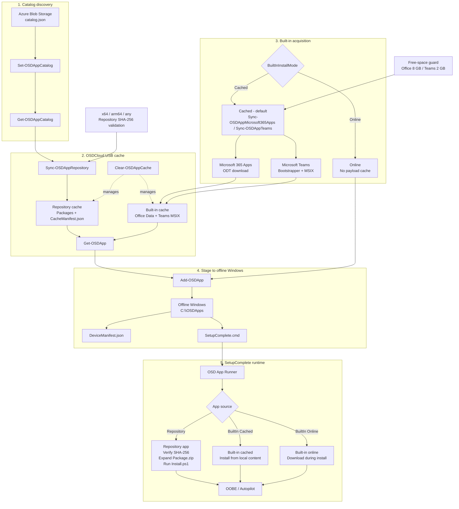

# OSD App Client

OSD App Client is a PowerShell module and standalone runtime for OSDCloud v2 application caching, staging, refresh, and pre-OOBE installation.

It runs after OSDCloud v2 has applied Windows and drivers. The module consumes a prepared OSD Apps repository, synchronizes and validates application packages, stages selected packages to the offline Windows volume, and appends a SetupComplete hook so the applications are installed before OOBE.


## Architecture overview



Typical WinPE usage after OSDCloud v2 has finished applying Windows and drivers:

```powershell
Set-OSDAppCatalog 'https://example.org/osdapps/catalog.json'

Get-OSDAppCatalog

Sync-OSDAppRepository

Get-OSDApp

Get-OSDApp NotepadPlusPlus | Add-OSDApp
```

OSDAppClient uses a cloud-hosted catalog for repository discovery and a local cache on the volume labeled `OSDCloud`. Built-in apps such as Microsoft 365 Apps and Teams do not require a catalog or repository sync. The client does not authenticate to Intune or Microsoft Graph during WinPE runtime.

## Scope

OSD App Client does not build application packages and does not authenticate to Intune or Microsoft Graph.

It consumes repositories that follow the OSD Apps repository contract.

The OSD App Catalog is cloud-native and referenced by an HTTP/HTTPS URL. Azure Blob Storage is the primary design target for hosting `catalog.json` and package content.

## Package author responsibility

Repository packages are executed during SetupComplete, before the interactive OOBE / Autopilot experience is available.

The package author is responsible for making sure the root-level `Install.ps1` performs a fully unattended installation. The script must not depend on interactive prompts, visible installer windows, user input, or UI-driven configuration.

Because this runs in a non-interactive deployment phase, `Install.ps1` should be designed to be stable and fault-tolerant. It should handle expected installer exit codes, validate prerequisites where appropriate, fail clearly on unrecoverable errors, and avoid leaving the device in an indeterminate state.

OSDAppClient provides the staging and execution framework, but it does not make a vendor installer unattended automatically. Packaging logic, silent switches, configuration files, prerequisite handling, and application-specific error handling remain the responsibility of the package author.

A good `Install.ps1` should therefore:

- use silent or unattended vendor-supported installation switches;
- avoid any dependency on visible UI;
- wait for installation processes to finish before exiting;
- return meaningful exit codes;
- handle common success codes such as reboot-required outcomes where applicable;
- validate required files and prerequisites before starting;
- write useful application-specific logs when troubleshooting value justifies it;
- be safe to run during SetupComplete before OOBE.


## First-phase runtime guarantees

The first implementation intentionally favors predictable behavior over automatic recovery.

### Installation order

Repository applications are written to `DeviceManifest.json` in the same order in which they are supplied to `Add-OSDApp`. The OSD App Runner processes those repository packages sequentially in that order.

Built-in applications are processed after repository packages.

Example:

```powershell
Add-OSDApp VCPlusPlusRuntime,LineOfBusinessApp,Microsoft365Apps,Teams
```

The repository packages are processed first in the requested order, followed by the built-in applications.

### Fail-fast behavior

The runner stops on the first unrecoverable installation failure. It does not continue silently with the remaining applications.

This is intentional for the pre-OOBE deployment phase: a failed prerequisite or incomplete baseline should be visible in the runner log instead of producing a partially configured device.

### Package integrity

Repository package SHA-256 is validated when content is synchronized and validated again from the staged Windows copy immediately before extraction and installation.

A staged package with a hash mismatch is not executed.

### Exit codes

Repository packages use `0` and `3010` as success codes by default. A package can define its own `SuccessCodes` metadata when other vendor-specific success codes are required.

### Cleanup

OSDAppClient does not automatically remove `%SystemDrive%\OSDApps` after installation in the first phase. Keeping staged content and logs available makes troubleshooting much easier while the runtime model is being validated.

Cleanup can be added later as an explicit, opt-in behavior.

### Logging contract

The runner uses structured JSON-lines logging. Important runtime events include:

```text
InstallStart
PackageIntegrityValidated
PackageIntegrityFailed
PackageExtractStart
PackageInstallStart
PackageInstallComplete
BuiltInInstallStart
BuiltInInstallComplete
InstallFailed
InstallComplete
```


## Package contract

Every application is represented by a single archive named `Package.zip`.

`Package.zip` must contain `Install.ps1` at the archive root.

Example:

```text
Package.zip
├── Install.ps1
├── setup.exe
├── Config/
├── Modules/
└── Files/
```

The ZIP remains compressed while it is stored, cached, and staged. It is extracted only at installation time.


## Reference Install.ps1 pattern

A repository package should keep vendor-specific installation behavior inside its own `Install.ps1`.

A minimal reference pattern:

```powershell
$ErrorActionPreference = 'Stop'

$installer = Get-ChildItem -Path $PSScriptRoot -Filter '*.exe' -File |
    Select-Object -First 1

if (-not $installer) {
    throw 'Installer not found.'
}

$process = Start-Process `
    -FilePath $installer.FullName `
    -ArgumentList '/S' `
    -WorkingDirectory $PSScriptRoot `
    -Wait `
    -PassThru

$successCodes = @(0,3010)

if ($process.ExitCode -notin $successCodes) {
    throw "Installer failed with exit code $($process.ExitCode)."
}

exit $process.ExitCode
```

This is only a pattern. The package author remains responsible for using the vendor-supported unattended switches, configuration, prerequisites, detection and error handling required by that application.


## Runtime flow

```text
OSDCloud v2 in WinPE
        ↓
Windows + drivers applied
        ↓
OSDAppClient
        ↓
Read central catalog
        ↓
Sync / validate Package.zip
        ↓
Stage selected packages to offline Windows
        ↓
Append SetupComplete.cmd
        ↓
Reboot into installed Windows
        ↓
OSD App Runner
        ↓
Expand Package.zip
        ↓
Run Install.ps1
        ↓
OOBE / Autopilot
```

## Initial commands

```powershell
Set-OSDAppCatalog
Get-OSDAppCatalog
Sync-OSDAppRepository
Get-OSDApp
Add-OSDApp
```

The lower-level cache, staging, and SetupComplete commands remain implementation details of the client workflow.

## Example

After OSDCloud v2 has finished applying Windows and drivers:

```powershell
Import-Module OSDAppClient

Add-OSDApp NotepadPlusPlus
```

OSD App Client automatically finds the volume labeled `OSDCloud`, uses `\OSDApps` on that volume as the cache, detects the offline Windows installation, stages the requested app, writes the device manifest, and appends the OSD App Runner to `SetupComplete.cmd`.

## Relationship with OSDAppRepo

OSDAppRepo is the recommended authoring and repository-management module. It builds and validates packages and maintains the central `catalog.json`. OSDAppClient consumes that catalog and the resulting repository contract.


## Logging

OSD App Client writes CMTrace-compatible logs so deployment activity can be read directly in CMTrace and CMTrace Open.

### WinPE / client log

Repository synchronization and staging events are written to:

```text
<CachePath>\Logs\Client.log
```

For the standard OSDCloud USB layout this is typically:

```text
E:\OSDApps\Logs\Client.log
```

The log includes events such as synchronization start/completion, packages already current, package acquisition, SHA-256 validation, staging, cache operations, and built-in acquisition. Event names are included at the start of the CMTrace message and structured details are appended as `key=value` pairs.

CMTrace severity types are used: information/debug = type 1, warning = type 2, error = type 3.

Logs are bounded and rotated automatically. The default limit is 1 MB per file with three retained rotated files. This means up to four log files can exist at once: the active `Client.log` plus `Client.log.1`, `Client.log.2`, and `Client.log.3`.

### Installed Windows / runtime log

Application installation events are written to:

```text
%SystemDrive%\OSDApps\Logs\Install.log
```

Runtime logs use the same CMTrace-compatible format and automatic rotation: the active `Install.log` plus up to three rotated files.


## Architecture resolution

OSD App Client understands the repository architectures:

```text
x64
arm64
any
```

The client detects the WinPE host architecture automatically:

```text
AMD64 -> x64
ARM64 -> arm64
```

For every requested application, package selection follows this order:

1. Exact architecture match.
2. `any` as an architecture-independent fallback.
3. Fail clearly when no compatible package exists.

OSD App Client does not silently select an x64 package on ARM64. Cross-architecture support must be represented explicitly by the repository package metadata.


## Typical WinPE workflow

After OSDCloud v2 has finished applying Windows and drivers:

```powershell
Set-OSDAppCatalog 'https://example.org/osdapps/catalog.json'

Get-OSDAppCatalog

Sync-OSDAppRepository

Get-OSDApp

Get-OSDApp NotepadPlusPlus | Add-OSDApp
```

`Set-OSDAppCatalog` configures the central cloud catalog for the current PowerShell session. `Get-OSDAppCatalog` reads that online catalog only; it does not download package content.

`Sync-OSDAppRepository` synchronizes repository content from the configured catalog to the `\OSDApps` cache on the USB volume labeled `OSDCloud`. The cache location is detected automatically.

`Get-OSDApp` shows what is locally available for deployment: cached repository apps plus built-in apps such as Microsoft 365 Apps and Teams. Repository entries report `Availability = Cached`; built-ins report `Availability = Available`.

Objects returned by `Get-OSDApp` can be piped directly to `Add-OSDApp`. Multiple apps are collected and staged together so the device manifest contains the complete requested application set.


## Built-in applications without a repository

### Dedicated built-in sync cmdlets

Each built-in application has its own synchronization command and parameter set:

```powershell
Sync-OSDAppMicrosoft365Apps
Sync-OSDAppTeams
```

These commands are both configuration and synchronization commands. Supplying different parameters changes the desired cache configuration and then refreshes the cache.

Example Microsoft 365 Apps configuration change:

```powershell
Sync-OSDAppMicrosoft365Apps `
    -Channel MonthlyEnterprise `
    -Architecture 64 `
    -ProductId O365ProPlusRetail `
    -Language nl-nl,en-us `
    -SharedComputerLicensing $true
```

Example Teams configuration:

```powershell
Sync-OSDAppTeams -Architecture x64
```

Built-in cache synchronization is intended for full Windows. During WinPE, cached built-in payloads are staged as-is and refreshed later by the standalone pre-install phase in full Windows. Repository synchronization remains available in WinPE.


OSDAppClient also supports a small set of built-in application flows that do **not** require an OSD App repository, `manifest.json`, or `Sync-OSDAppRepository`.

Currently supported:

```text
Microsoft365Apps
Teams
```

These built-in applications are prepared directly by OSDAppClient and staged for installation during SetupComplete. In cached mode, WinPE stages the existing built-in cache without refreshing it. During SetupComplete in full Windows, the standalone pre-install phase refreshes the configured Office and Teams caches when possible, restages current content, and then starts the installer. `-BuiltInInstallMode Online` skips the cached payload model and stages only the vendor bootstrapper/configuration.

Examples:

```powershell
Add-OSDApp Microsoft365Apps
```

```powershell
Add-OSDApp Teams
```

They can also be staged together:

```powershell
Add-OSDApp Microsoft365Apps,Teams
```

For built-in applications, OSDAppClient still uses the same runtime model:

```text
WinPE
  ↓
Add-OSDApp
  ↓
stage installer/bootstrapper and metadata
  ↓
SetupComplete
  ↓
OSD App Runner
  ↓
install application before OOBE / Autopilot
```

Repository-based applications remain available alongside built-ins and use `Get-OSDAppCatalog` to inspect the central catalog, `Sync-OSDAppRepository` to populate the local cache, and `Get-OSDApp` to discover what is locally deployment-ready.

## Optional built-in caching

Microsoft 365 Apps and Teams can be used in two modes.

By default, `Add-OSDApp` uses `BuiltInInstallMode = Cached`. In WinPE, the command stages the existing built-in cache to the offline Windows installation. The standalone pre-install phase in full Windows refreshes the built-in caches immediately before installation.

```text
Default / Cached
→ WinPE stages the existing built-in cache
→ SetupComplete starts the standalone pre-install refresh in full Windows
→ Office and Teams caches are refreshed when possible
→ current payload is restaged locally
→ the runner installs from local staged content
```

For environments where bandwidth is plentiful and pre-caching is not desirable, use online mode:

```powershell
Add-OSDApp Microsoft365Apps,Teams -BuiltInInstallMode Online
```

```text
Online
→ no built-in payload synchronization
→ only bootstrapper/configuration is staged
→ SetupComplete downloads the application payload from Microsoft
```

The mode applies only to built-in applications. Repository packages continue to use the normal repository cache.

`Sync-OSDAppMicrosoft365Apps` and `Sync-OSDAppTeams` are the explicit built-in cache configuration/synchronization commands. Each built-in has its own parameter set, and each sync invocation defines the desired configuration for that cache.

Synchronize the built-ins independently:

```powershell
Sync-OSDAppMicrosoft365Apps
Sync-OSDAppTeams
```

The cache is stored below:

```text
<OSDCloud volume>:\OSDApps\BuiltIn
```

After synchronization, `Get-OSDApp` reports the built-in as `Availability = Cached` and shows the detected cached version.

When a Microsoft 365 Apps cache already exists, a plain `Add-OSDApp Microsoft365Apps` reuses the `configuration.xml` stored with that cache. Supplying Office parameters to `Add-OSDApp` explicitly overrides the cached configuration.

### Microsoft 365 Apps cache behavior

For Microsoft 365 Apps, `Sync-OSDAppMicrosoft365Apps` defines the desired Office configuration and then runs the Office Deployment Tool in `/download` mode. ODT maintains the `Office\Data` content under the built-in cache.

Running `Sync-OSDAppMicrosoft365Apps` again can also change the desired Office settings. The cmdlet rewrites the generated `configuration.xml`, synchronizes the cache with ODT, and records the resulting configuration and detected Office version in `CacheInfo.json`.

The same Office configuration options used by `Add-OSDApp Microsoft365Apps` are available on `the dedicated built-in sync cmdlets`.

Example:

```powershell
Sync-OSDAppMicrosoft365Apps `
    -OfficeChannel Current `
    -OfficeArchitecture 64 `
    -OfficeProductId O365ProPlusRetail `
    -OfficeLanguage nl-nl,en-us `
    -OfficeSharedComputerLicensing $true
```

When cached Office content is staged, SetupComplete still runs:

```text
setup.exe /configure configuration.xml
```

Because the `Office\Data` payload is present beside the Office Deployment Tool, ODT can install from the local staged content.

### Microsoft Teams cache behavior

For Teams, OSDAppClient downloads the latest Microsoft Teams bootstrapper and the official Teams MSIX for the selected architecture.

```powershell
Sync-OSDAppTeams
```

Architecture defaults to the current host architecture and can be overridden:

```powershell
Sync-OSDAppTeams -TeamsArchitecture x64
Sync-OSDAppTeams -TeamsArchitecture arm64
```

The module reads the version from the downloaded MSIX and stores it in `CacheInfo.json`. When the downloaded version matches the already cached version, the existing cached MSIX is retained.

When a Teams MSIX is cached, `Add-OSDApp Teams` records the offline package in `DeviceManifest.json`. During SetupComplete the runner uses the Microsoft-supported offline provisioning form:

```text
teamsbootstrapper.exe -p -o <local teams.msix>
```

Without a cached MSIX, the existing online `teamsbootstrapper.exe -p` behavior remains unchanged.

Teams cache freshness is checked first using lightweight HTTP response metadata from the official Microsoft MSIX endpoint. When the remote ETag matches the cached metadata, no MSIX payload is downloaded. If ETag is unavailable, Last-Modified plus Content-Length are used as a fallback. Only when the remote metadata differs, or when no trustworthy cached metadata exists, is the current MSIX downloaded and its embedded package version inspected.

## Built-in Microsoft 365 Apps support

Microsoft 365 Apps can be staged without an OSD App repository, repository manifest, or prior repository synchronization:

```powershell
Add-OSDApp Microsoft365Apps
```

In cached mode, WinPE does not run the Office Deployment Tool. It stages the existing Microsoft 365 Apps cache to the offline Windows installation. During SetupComplete in full Windows, the standalone pre-install phase runs ODT `/download` against the USB cache, refreshes the staged Office payload, and then the runner installs Office locally. If refresh is unavailable, the previously staged payload remains the fallback.

During SetupComplete, the OSD App Runner starts:

```text
setup.exe /configure configuration.xml
```

At that point the Office Deployment Tool acquires the required Microsoft 365 Apps content and installs it before OOBE / Autopilot continues. The generated configuration intentionally omits `SourcePath`, so ODT uses the normal Microsoft CDN during `/configure`.

Cached mode is the default for `Add-OSDApp Microsoft365Apps`. Use `-BuiltInInstallMode Online` when Office content should instead be downloaded during SetupComplete.

A common customized deployment:

```powershell
Add-OSDApp Microsoft365Apps `
    -OfficeChannel MonthlyEnterprise `
    -OfficeArchitecture 64 `
    -OfficeProductId O365ProPlusRetail `
    -OfficeLanguage nl-nl,en-us `
    -OfficeExcludeApp Access,Publisher
```

Supported `-OfficeChannel` values follow the current Office Deployment Tool channel values:

```text
Current
MonthlyEnterprise
SemiAnnual
CurrentPreview
SemiAnnualPreview
BetaChannel
```

`BetaChannel` is available in ODT but Microsoft classifies Beta Channel as unsupported for production use.

Supported `-OfficeArchitecture` values are `64` and `32`. On Windows 11 Arm devices, Microsoft 365 Apps uses the 64-bit Office deployment and automatically installs Arm-optimized components.

Built-in Microsoft 365 Apps currently supports these product IDs:

```text
O365ProPlusRetail
O365BusinessRetail
```

Supported `-OfficeExcludeApp` values:

```text
Access
Excel
Groove
Lync
OneDrive
OneNote
Outlook
OutlookForWindows
PowerPoint
Publisher
Teams
Word
```

Multiple languages can be supplied:

```powershell
Add-OSDApp Microsoft365Apps -OfficeLanguage nl-nl,en-us
```

For advanced Office Deployment Tool scenarios, a complete custom XML file can be supplied instead:

```powershell
Add-OSDApp Microsoft365Apps -ConfigurationXml .\configuration.xml
```

When a custom XML file is supplied, OSDAppClient copies it unchanged. For a fully offline SetupComplete installation, the custom configuration should either omit `SourcePath` or reference content that will still be available after the reboot.

Repository-based apps and Microsoft 365 Apps can also be staged in one call:

```powershell
Add-OSDApp NotepadPlusPlus,Microsoft365Apps
```

Microsoft 365 Apps is the first built-in installer path. It is intentionally implemented separately from the repository package contract. In the current implementation only the ODT bootstrapper and configuration are staged in WinPE; Office payload caching is reserved for a future enhancement.


## Built-in Microsoft Teams support

Microsoft Teams can also be staged without an OSD App repository, repository manifest, or prior repository synchronization:

```powershell
Add-OSDApp Teams
```

In cached mode, WinPE stages the existing Teams bootstrapper and MSIX without refreshing the built-in cache. During SetupComplete in full Windows, the standalone pre-install phase checks Teams freshness, refreshes the USB cache when needed, restages the current payload, and then the runner provisions Teams.

During SetupComplete, the OSD App Runner executes:

```text
teamsbootstrapper.exe -p
```

The Teams bootstrapper then downloads and provisions the latest Teams MSIX for all users on the device.

The optional Teams Meeting Add-in can be installed machine-wide with:

```powershell
Add-OSDApp Teams -TeamsInstallMeetingAddin $true
```

This causes SetupComplete to run:

```text
teamsbootstrapper.exe -p --installTMA
```

Cached mode is the default for `Add-OSDApp Teams`: the built-in cache is refreshed first, the Teams MSIX is staged, and SetupComplete provisions Teams from the local package. Use `-BuiltInInstallMode Online` to skip MSIX caching and let `teamsbootstrapper.exe -p` download Teams during SetupComplete.


## Catalog configuration and discovery

The central OSD App Catalog is configured once per PowerShell session:

```powershell
Set-OSDAppCatalog -Uri 'https://example.blob.core.windows.net/osdapps/catalog.json'
```

The configuration is session-scoped. Nothing has to exist on the deployment USB before the module is loaded.

Use `Get-OSDAppCatalog` to inspect what the central catalog currently offers:

```powershell
Get-OSDAppCatalog
```

This command reads the online catalog only. It does not synchronize or download package content.

An explicit catalog URL can also be supplied for one-off inspection:

```powershell
Get-OSDAppCatalog -Uri 'https://example.blob.core.windows.net/osdapps/catalog.json'
```

Synchronize repository packages to the local OSDCloud media with:

```powershell
Sync-OSDAppRepository
```

After synchronization, use `Get-OSDApp` to see what is locally deployment-ready:

```powershell
Get-OSDApp
```

Typical output conceptually distinguishes the source and availability:

```text
Id                  Source       Availability
--                  ------       ------------
NotepadPlusPlus     Repository   Cached
Microsoft365Apps    BuiltIn      Available
Teams               BuiltIn      Available
```

Built-in applications are part of OSDAppClient and therefore do not appear in the online catalog. They are returned by `Get-OSDApp` even when no repository has been synchronized.

The intended cloud-native layout is:

```text
Azure Blob Storage
└── osdapps/
    ├── catalog.json
    └── Packages/
        └── <AppId>/
            └── <Version>/
                └── <Architecture>/
                    └── Package.zip
```


### Download progress

Built-in cache synchronization shows interactive PowerShell progress.

For Microsoft Teams, OSDAppClient uses the HTTP content length when available and shows transferred megabytes and a percentage while downloading the bootstrapper and MSIX.

For Microsoft 365 Apps, the Office Deployment Tool controls the payload download internally and does not expose a reliable total byte count. OSDAppClient therefore shows live cached size growth in GB while `setup.exe /download` is running rather than a misleading percentage.

### Cache free-space guard

Before synchronizing built-in payloads, OSDAppClient checks the remaining free space on the volume labeled `OSDCloud`.

Default minimum free-space thresholds:

```text
Microsoft 365 Apps : 8 GB
Microsoft Teams    : 2 GB
```

These are conservative safety thresholds, not exact payload-size predictions. They prevent a cache refresh from starting when the deployment media is already close to full.

The thresholds can be overridden when needed:

```powershell
Add-OSDApp Microsoft365Apps,Teams `
    -OfficeMinimumFreeSpaceGB 6 `
    -TeamsMinimumFreeSpaceGB 1
```

or when explicitly pre-caching:

```powershell
Sync-OSDAppMicrosoft365Apps `
    -OfficeMinimumFreeSpaceGB 6
```

Every free-space check is written to `Client.log` as a `FreeSpaceCheck` event. If the threshold is not met, the sync stops before downloading payload content.


## Clearing the USB cache

`Clear-OSDAppCache` only manages the OSD Apps cache on the volume labeled `OSDCloud`. It does **not** remove staged runtime content from `C:\OSDApps`.

Clear all cached application content:

```powershell
Clear-OSDAppCache -All
```

Clear only repository packages and `CacheManifest.json`:

```powershell
Clear-OSDAppCache -Repository
```

Clear only built-in payload caches:

```powershell
Clear-OSDAppCache -BuiltIn
```

Clear a specific application:

```powershell
Clear-OSDAppCache -Name Teams
Clear-OSDAppCache -Name Microsoft365Apps
Clear-OSDAppCache -Name NotepadPlusPlus
```

For repository applications, the corresponding entry is also removed from `CacheManifest.json`.

The client log is preserved by default. Every cache-clear operation is written to:

```text
<OSDCloud volume>:\OSDApps\Logs\Client.log
```

Logs are removed only when explicitly requested:

```powershell
Clear-OSDAppCache -All -IncludeLogs
```

When `-IncludeLogs` is used, the existing log files are cleared and a fresh `Client.log` is created immediately afterwards with `CacheLogsCleared` and `CacheClearComplete` events. This keeps the cleanup action itself auditable.

The command supports `-WhatIf`:

```powershell
Clear-OSDAppCache -All -WhatIf
```
