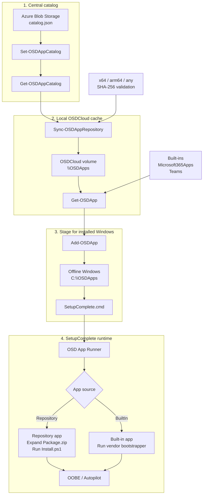

# OSD App Client

OSD App Client is a PowerShell module for Windows PE, designed specifically to complement OSDCloud v2.

It runs after OSDCloud v2 has applied Windows and drivers. The module consumes a prepared OSD Apps repository, synchronizes and validates application packages, stages selected packages to the offline Windows volume, and appends a SetupComplete hook so the applications are installed before OOBE.


## Architecture overview



Typical WinPE usage after OSDCloud v2 has finished applying Windows and drivers:

```powershell
Set-OSDAppCatalog 'https://example.org/osdapps/catalog.json'

Get-OSDAppCatalog

Sync-OSDAppRepository

Get-OSDApp

Get-OSDApp NotepadPlusPlus | Add-OSDApp
```

OSDAppClient uses a cloud-hosted catalog for repository discovery and a local cache on the volume labeled `OSDCloud`. Built-in apps such as Microsoft 365 Apps and Teams do not require a catalog or repository sync. The client does not authenticate to Intune or Microsoft Graph during WinPE runtime.

## Scope

OSD App Client does not build application packages and does not authenticate to Intune or Microsoft Graph.

It consumes repositories that follow the OSD Apps repository contract.

The OSD App Catalog is cloud-native and referenced by an HTTP/HTTPS URL. Azure Blob Storage is the primary design target for hosting `catalog.json` and package content.

## Package contract

Every application is represented by a single archive named `Package.zip`.

`Package.zip` must contain `Install.ps1` at the archive root.

Example:

```text
Package.zip
├── Install.ps1
├── setup.exe
├── Config/
├── Modules/
└── Files/
```

The ZIP remains compressed while it is stored, cached, and staged. It is extracted only at installation time.

## Runtime flow

```text
OSDCloud v2 in WinPE
        ↓
Windows + drivers applied
        ↓
OSDAppClient
        ↓
Read central catalog
        ↓
Sync / validate Package.zip
        ↓
Stage selected packages to offline Windows
        ↓
Append SetupComplete.cmd
        ↓
Reboot into installed Windows
        ↓
OSD App Runner
        ↓
Expand Package.zip
        ↓
Run Install.ps1
        ↓
OOBE / Autopilot
```

## Initial commands

```powershell
Set-OSDAppCatalog
Get-OSDAppCatalog
Sync-OSDAppRepository
Get-OSDApp
Add-OSDApp
```

The lower-level cache, staging, and SetupComplete commands remain implementation details of the client workflow.

## Example

After OSDCloud v2 has finished applying Windows and drivers:

```powershell
Import-Module OSDAppClient

Add-OSDApp NotepadPlusPlus
```

OSD App Client automatically finds the volume labeled `OSDCloud`, uses `\OSDApps` on that volume as the cache, detects the offline Windows installation, stages the requested app, writes the device manifest, and appends the OSD App Runner to `SetupComplete.cmd`.

## Relationship with OSDAppRepo

OSDAppRepo is the recommended authoring and repository-management module. It builds and validates packages and maintains the central `catalog.json`. OSDAppClient consumes that catalog and the resulting repository contract.


## Logging

OSD App Client writes structured JSON-lines logs designed for both human troubleshooting and machine analysis.

### WinPE / client log

Repository synchronization and staging events are written to:

```text
<CachePath>\Logs\Client.log
```

For the standard OSDCloud USB layout this is typically:

```text
E:\OSDApps\Logs\Client.log
```

The log includes events such as synchronization start/completion, packages already current, package acquisition, SHA-256 validation, and staging.

Logs are bounded and rotated automatically. The default limit is 1 MB per file with three retained rotated files.

### Installed Windows / runtime log

Application installation events are written to:

```text
%SystemDrive%\OSDApps\Logs\Install.log
```

Runtime logs use the same bounded JSON-lines format and automatic rotation.


## Architecture resolution

OSD App Client understands the repository architectures:

```text
x64
arm64
any
```

The client detects the WinPE host architecture automatically:

```text
AMD64 -> x64
ARM64 -> arm64
```

For every requested application, package selection follows this order:

1. Exact architecture match.
2. `any` as an architecture-independent fallback.
3. Fail clearly when no compatible package exists.

OSD App Client does not silently select an x64 package on ARM64. Cross-architecture support must be represented explicitly by the repository package metadata.


## Typical WinPE workflow

After OSDCloud v2 has finished applying Windows and drivers:

```powershell
Set-OSDAppCatalog 'https://example.org/osdapps/catalog.json'

Get-OSDAppCatalog

Sync-OSDAppRepository

Get-OSDApp

Get-OSDApp NotepadPlusPlus | Add-OSDApp
```

`Set-OSDAppCatalog` configures the central cloud catalog for the current PowerShell session. `Get-OSDAppCatalog` reads that online catalog only; it does not download package content.

`Sync-OSDAppRepository` synchronizes repository content from the configured catalog to the `\OSDApps` cache on the USB volume labeled `OSDCloud`. The cache location is detected automatically.

`Get-OSDApp` shows what is locally available for deployment: cached repository apps plus built-in apps such as Microsoft 365 Apps and Teams. Repository entries report `Availability = Cached`; built-ins report `Availability = Available`.

Objects returned by `Get-OSDApp` can be piped directly to `Add-OSDApp`. Multiple apps are collected and staged together so the device manifest contains the complete requested application set.


## Built-in applications without a repository

OSDAppClient also supports a small set of built-in application flows that do **not** require an OSD App repository, `manifest.json`, or `Sync-OSDAppRepository`.

Currently supported:

```text
Microsoft365Apps
Teams
```

These built-in applications are prepared directly by OSDAppClient and staged for installation during SetupComplete.

Examples:

```powershell
Add-OSDApp Microsoft365Apps
```

```powershell
Add-OSDApp Teams
```

They can also be staged together:

```powershell
Add-OSDApp Microsoft365Apps,Teams
```

For built-in applications, OSDAppClient still uses the same runtime model:

```text
WinPE
  ↓
Add-OSDApp
  ↓
stage installer/bootstrapper and metadata
  ↓
SetupComplete
  ↓
OSD App Runner
  ↓
install application before OOBE / Autopilot
```

Repository-based applications remain available alongside built-ins and use `Get-OSDAppCatalog` to inspect the central catalog, `Sync-OSDAppRepository` to populate the local cache, and `Get-OSDApp` to discover what is locally deployment-ready.

## Built-in Microsoft 365 Apps support

Microsoft 365 Apps can be staged without an OSD App repository, repository manifest, or prior repository synchronization:

```powershell
Add-OSDApp Microsoft365Apps
```

OSDAppClient downloads only the Office Deployment Tool bootstrapper and prepares the Office configuration in WinPE. It then stages those files to the offline Windows installation.

No Microsoft 365 Apps payload is downloaded in WinPE at this stage.

During SetupComplete, the OSD App Runner starts:

```text
setup.exe /configure configuration.xml
```

At that point the Office Deployment Tool acquires the required Microsoft 365 Apps content and installs it before OOBE / Autopilot continues. The generated configuration intentionally omits `SourcePath`, so ODT uses the normal Microsoft CDN during `/configure`.

Future offline caching support can add a separate WinPE `/download` phase without changing the SetupComplete installation model.

A common customized deployment:

```powershell
Add-OSDApp Microsoft365Apps `
    -OfficeChannel MonthlyEnterprise `
    -OfficeArchitecture 64 `
    -OfficeProductId O365ProPlusRetail `
    -OfficeLanguage nl-nl,en-us `
    -OfficeExcludeApp Access,Publisher
```

Supported `-OfficeChannel` values follow the current Office Deployment Tool channel values:

```text
Current
MonthlyEnterprise
SemiAnnual
CurrentPreview
SemiAnnualPreview
BetaChannel
```

`BetaChannel` is available in ODT but Microsoft classifies Beta Channel as unsupported for production use.

Supported `-OfficeArchitecture` values are `64` and `32`. On Windows 11 Arm devices, Microsoft 365 Apps uses the 64-bit Office deployment and automatically installs Arm-optimized components.

Built-in Microsoft 365 Apps currently supports these product IDs:

```text
O365ProPlusRetail
O365BusinessRetail
```

Supported `-OfficeExcludeApp` values:

```text
Access
Excel
Groove
Lync
OneDrive
OneNote
Outlook
OutlookForWindows
PowerPoint
Publisher
Teams
Word
```

Multiple languages can be supplied:

```powershell
Add-OSDApp Microsoft365Apps -OfficeLanguage nl-nl,en-us
```

For advanced Office Deployment Tool scenarios, a complete custom XML file can be supplied instead:

```powershell
Add-OSDApp Microsoft365Apps -ConfigurationXml .\configuration.xml
```

When a custom XML file is supplied, OSDAppClient copies it unchanged. For a fully offline SetupComplete installation, the custom configuration should either omit `SourcePath` or reference content that will still be available after the reboot.

Repository-based apps and Microsoft 365 Apps can also be staged in one call:

```powershell
Add-OSDApp NotepadPlusPlus,Microsoft365Apps
```

Microsoft 365 Apps is the first built-in installer path. It is intentionally implemented separately from the repository package contract. In the current implementation only the ODT bootstrapper and configuration are staged in WinPE; Office payload caching is reserved for a future enhancement.


## Built-in Microsoft Teams support

Microsoft Teams can also be staged without an OSD App repository, repository manifest, or prior repository synchronization:

```powershell
Add-OSDApp Teams
```

In WinPE, OSDAppClient downloads only the latest Microsoft `teamsbootstrapper.exe` and stages it to the offline Windows installation. Teams itself is not installed in WinPE.

During SetupComplete, the OSD App Runner executes:

```text
teamsbootstrapper.exe -p
```

The Teams bootstrapper then downloads and provisions the latest Teams MSIX for all users on the device.

The optional Teams Meeting Add-in can be installed machine-wide with:

```powershell
Add-OSDApp Teams -TeamsInstallMeetingAddin $true
```

This causes SetupComplete to run:

```text
teamsbootstrapper.exe -p --installTMA
```

The built-in Teams flow currently uses the online bootstrapper only. Offline MSIX caching can be added later without changing the SetupComplete model.


## Catalog configuration and discovery

The central OSD App Catalog is configured once per PowerShell session:

```powershell
Set-OSDAppCatalog -Uri 'https://example.blob.core.windows.net/osdapps/catalog.json'
```

The configuration is session-scoped. Nothing has to exist on the deployment USB before the module is loaded.

Use `Get-OSDAppCatalog` to inspect what the central catalog currently offers:

```powershell
Get-OSDAppCatalog
```

This command reads the online catalog only. It does not synchronize or download package content.

An explicit catalog URL can also be supplied for one-off inspection:

```powershell
Get-OSDAppCatalog -Uri 'https://example.blob.core.windows.net/osdapps/catalog.json'
```

Synchronize repository packages to the local OSDCloud media with:

```powershell
Sync-OSDAppRepository
```

After synchronization, use `Get-OSDApp` to see what is locally deployment-ready:

```powershell
Get-OSDApp
```

Typical output conceptually distinguishes the source and availability:

```text
Id                  Source       Availability
--                  ------       ------------
NotepadPlusPlus     Repository   Cached
Microsoft365Apps    BuiltIn      Available
Teams               BuiltIn      Available
```

Built-in applications are part of OSDAppClient and therefore do not appear in the online catalog. They are returned by `Get-OSDApp` even when no repository has been synchronized.

The intended cloud-native layout is:

```text
Azure Blob Storage
└── osdapps/
    ├── catalog.json
    └── Packages/
        └── <AppId>/
            └── <Version>/
                └── <Architecture>/
                    └── Package.zip
```
