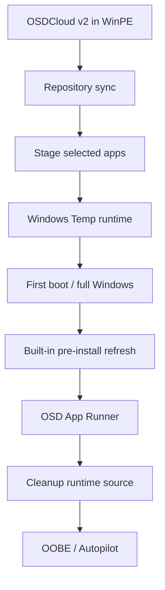

# Architecture

OSD Apps separates application acquisition, staging, refresh, installation, and cleanup.

## End-to-end flow



## Repository lifecycle

```text
Azure Blob / repository
→ catalog.json
→ Sync-OSDAppRepository in WinPE
→ validate SHA-256
→ use/update the OSDCloud USB cache when available
→ Add-OSDApp
→ stage Package.zip to Windows Temp
→ runner validates SHA-256 again
→ extract
→ run Install.ps1
```

Repository acquisition stays in WinPE because it does not depend on a vendor installer.

## Built-in lifecycle

```text
Add built-in deployment intent in WinPE
→ stage existing cache when available
→ first boot into full Windows
→ detect optional OSDCloud USB cache
→ USB present: use/update cache
→ USB absent: acquire directly to Windows Temp
→ ensure local payload is complete
→ install
```

Microsoft 365 Apps and Teams intentionally share this lifecycle.

## Why built-ins refresh in full Windows

The Office Deployment Tool cannot run in the x64 WinPE environment used during OSD Apps testing because the current ODT bootstrapper requires x86 Windows runtime / side-by-side components that are not available there.

Microsoft Teams synchronization can technically run in WinPE. OSD Apps still performs Teams refresh in the same full-Windows pre-install phase so built-in acquisition, update, fallback, logging, and troubleshooting follow one consistent model.

If Microsoft 365 Apps or Teams must be managed entirely from WinPE, package them as normal repository applications instead of using the built-in flow.

## Runtime locations

Temporary runtime:

```text
%SystemRoot%\Temp\OSDApps
```

Persistent logs:

```text
%ProgramData%\OSDApps\Logs
```

The runtime directory can contain:

```text
DeviceManifest.json
Invoke-OSDAppPreInstall.ps1
Invoke-OSDAppRunner.ps1
Packages\
BuiltIn\
Work\
```

After a successful installation the runtime directory is removed automatically unless `-KeepSource` was specified.


## Optional USB cache

The built-in deployment path does not require USB media. Cache usage is automatic: when a connected volume with label `OSDCloud` is detected, it becomes the built-in cache source and destination. If no such volume exists, built-in content is downloaded directly to `%SystemRoot%\Temp\OSDApps` during the full-Windows pre-install phase.

This gives three supported built-in scenarios:

```text
OSDCloud USB + online  → use cache, refresh/update it, then install locally
OSDCloud USB + offline → use cached payload if complete
No USB + online        → acquire directly to local runtime and install
```

No USB + offline requires a previously staged local payload; otherwise PreInstall fails before the runner starts.
