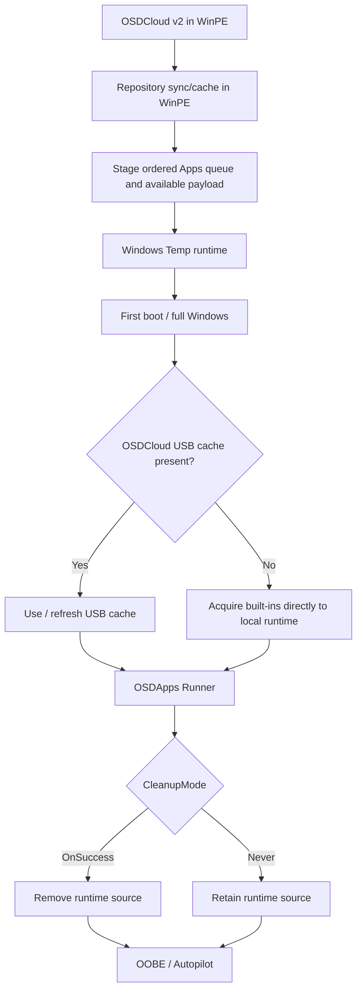

# Architecture


OSDApps separates application ownership, acquisition, staging, freshness checks, installation, and cleanup.

## End-to-end flow



## Two source models

### Repository applications

Repository applications are organization-managed packages.

```text
repository
→ catalog.json
→ Apps/<AppId>/<Version>/<Architecture>/manifest.json
→ resolve compatible package in WinPE
→ download/copy Package.zip
→ validate SHA-256
→ update optional OSDCloud cache
→ stage Package.zip to Windows Temp
→ Runner validates SHA-256 again
→ extract
→ run Package/Install.ps1
```

Repository freshness is determined by the self-maintained repository metadata and SHA-256.

### Built-in applications

Built-ins are vendor-native integrations maintained by OSDApps.

```text
WinPE
→ stage built-in deployment intent
→ stage existing cache as fallback when available

Full Windows / PreInstall
→ detect optional OSDCloud USB cache
→ check vendor freshness
→ refresh/download only when required
→ ensure complete local payload
→ Runner installs
```

Built-ins refresh in full Windows so every vendor integration can use one consistent acquisition, fallback, logging, and troubleshooting model.

Microsoft 365 Apps uses the Office Deployment Tool for synchronization. Teams, Adobe Acrobat Unified, Google Chrome Enterprise, and Mozilla Firefox Enterprise use vendor-native sources with lightweight freshness checks where applicable.

## Why Office refreshes in full Windows

The Office Deployment Tool used by the Microsoft 365 Apps built-in is not treated as a WinPE acquisition mechanism. OSDApps deliberately runs the ODT synchronization step in full Windows, where the vendor-supported deployment runtime is available.

If an organization prefers to control the Office package and version entirely in WinPE, Microsoft 365 Apps can instead be delivered as a normal repository application.

## Optional OSDCloud USB cache

A connected volume with the configured cache label (default `OSDCloud`) is detected automatically.

```text
USB + online
→ use complete cache as fallback
→ check/refresh current content
→ stage locally
→ install

USB + offline
→ use complete cached content
→ stage locally
→ install

No USB + online
→ acquire built-ins directly to Windows Temp
→ install
```

No USB + offline requires a usable payload to have been staged already. Otherwise PreInstall stops before the Runner starts.

A cache hit changes acquisition performance, not installation semantics. The Runner always installs from local staged content.

## Runtime locations

Temporary runtime:

```text
%SystemRoot%\Temp\OSDApps
```

Default persistent runtime log:

```text
%ProgramData%\OSDApps\Logs\Runtime.log
```

Module/cache operations use:

```text
<OSDCloud>:\OSDApps\Logs\Client.log
```

Typical runtime content:

```text
DeviceManifest.json
Invoke-OSDAppPreInstall.ps1
Invoke-OSDAppRunner.ps1
Packages\
BuiltIn\
Work\
```

With `CleanupMode OnSuccess`, the runtime source is removed after a successful run. With `CleanupMode Never`, it is retained. On failure, source is retained automatically for troubleshooting.

## Source resolution rules

Built-in acquisition follows one resolver:

```text
1. Detect optional OSDCloud cache
2. Stage complete cached content as fallback when available
3. Check vendor freshness when online
4. Refresh or acquire only when required
5. Ensure complete payload under Windows Temp
6. Start the Runner
```

A refresh failure is non-fatal when a complete staged fallback exists. It is fatal when no usable payload is available.

## Metadata model

```text
catalog.json                                         online repository index
Apps/<AppId>/<Version>/<Architecture>/manifest.json package metadata
CacheCatalog.json                                    local repository-cache snapshot
CacheInfo.json                                       built-in cache metadata
DeviceManifest.json                                  per-device ordered Apps queue
```

## Device manifest

`DeviceManifest.json` contains one ordered `Apps` array for repository and built-in applications.

`Source` identifies the execution path:

```text
Repository
BuiltIn
```

Every `Add-*` operation appends or moves the complete application entry to the end of the queue. PreInstall filters the built-in entries for acquisition; the Runner executes the complete `Apps[]` array from top to bottom.

See also:

- [Built-in applications](built-in-apps.md)
- [Repository applications](repository.md)
- [Runtime and cleanup](runtime.md)
- [Validation matrix](testing.md)
