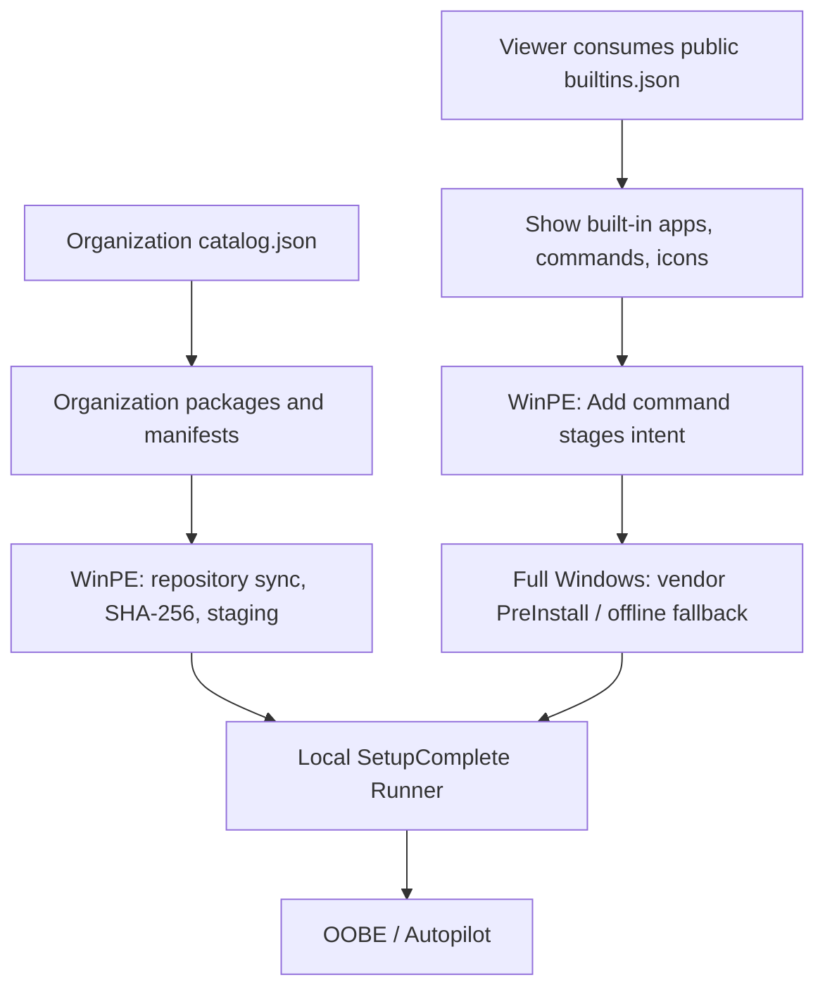

# Public built-in metadata for viewers

OSDApps publishes a stable, machine-readable **built-in catalog** at [`metadata/builtins.json`](../metadata/builtins.json). It is designed for external viewers, documentation pages and dashboards, without parsing the PowerShell module.

**Public raw endpoint:**

```text
https://raw.githubusercontent.com/roryvossepoel/OSDApps/main/metadata/builtins.json
```

This file is a **catalog of OSDApps' vendor-native built-in integrations**, **not** a listing of an organization's self-maintained application repository. For organization-managed applications, point a private or authorized viewer to that organization's own `catalog.json` and then resolve the linked package `manifest.json` files. The sample repository under `Examples/Repository` deliberately does not publish any private applications.

## Stable schema and fields

`SchemaVersion: 1` and `Applications[]` remain unchanged in 0.32.0.

| Field | Viewer use |
| --- | --- |
| `Id`, `DisplayName`, `Vendor` | Stable key and human-readable label |
| `Source`, `Acquisition`, `SyncPhase` | Distinguish built-in ownership and acquisition phase |
| `AddCommand`, `SyncCommand` | Show ready-to-copy PowerShell examples |
| `Architectures`, `DefaultArchitecture` | Selectable architectures, not necessarily field-validated ones |
| `Channels`, `DefaultChannel`, `ProductIds`, `DefaultLanguage` | Optional product-specific settings; check for presence before rendering |
| `CachePath` | Illustrate the USB cache layout (`<architecture>` and similar segments are placeholders) |
| `RepositoryAlternative` | Explain the organization-maintained alternative |
| `IconUrl` | Official public repository-hosted SVG logo for the card |

Use `Id` as the card key rather than display name. Render optional fields only when available. Keep the public schema backward-compatible; bump `SchemaVersion` and coordinate consumers before any future breaking change.

## 0.32.0: Cisco Webex

The existing public catalog now includes **six** built-in applications, including `CiscoWebex` with:

```json
{
  "Id": "CiscoWebex",
  "DisplayName": "Cisco Webex",
  "Source": "BuiltIn",
  "Vendor": "Cisco",
  "Acquisition": "VendorMsi",
  "SyncPhase": "FullWindowsPreInstall",
  "AddCommand": "Add-OSDAppCiscoWebex",
  "SyncCommand": "Sync-OSDAppCiscoWebex",
  "Architectures": ["x64", "arm64"],
  "DefaultArchitecture": "x64",
  "CachePath": "BuiltIn/CiscoWebex/<architecture>",
  "RepositoryAlternative": true,
  "IconUrl": "https://raw.githubusercontent.com/roryvossepoel/OSDApps/main/metadata/icons/ciscowebex.svg"
}
```

The JSON describes **supported choices**. In the 0.32.0 field tests, **x64** download, online SetupComplete, cold/warm USB caching and offline SetupComplete were validated; **ARM64 has not been field-tested yet**. Do not infer testing status from `Architectures`.

## Acquisition and deployment at a glance



The two data sources must not be conflated: public built-ins do **not** expose or enumerate any organization's private repository.

## Viewer publication checklist

1. Merge and release the application with its icon under `metadata/icons/` and entry under `metadata/builtins.json`.
2. Verify JSON validity, required metadata keys, unique IDs, exported Add/Sync command names and icon files (covered by Pester).
3. Confirm the raw `main` JSON and corresponding icon URLs are available after merge.
4. Refresh the website/CDN cache. A viewer reading the raw `main` JSON dynamically needs no separate list update; a viewer using a compiled snapshot needs to refresh that snapshot.

See [Built-in applications](built-in-apps.md), [Repository applications](repository.md) and [Release process](releasing.md).
